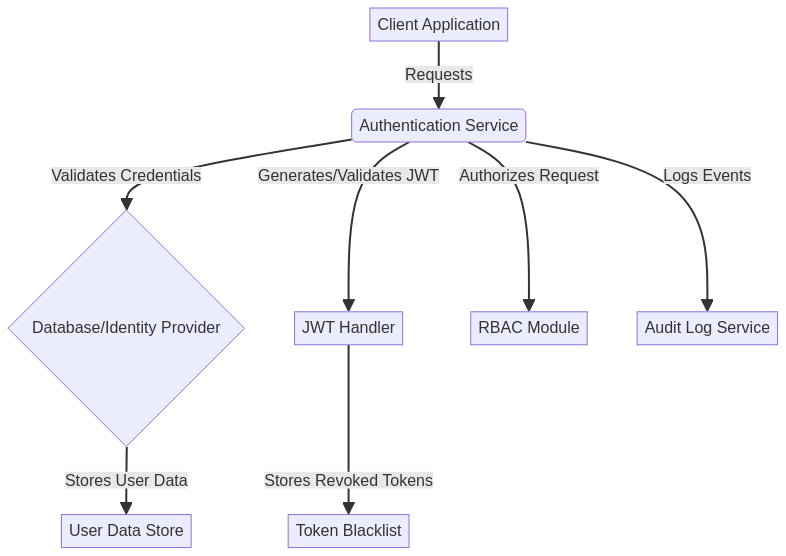

# TypeScript-Auth-Service

<div align="center">


**Authentication and Authorization Service**

*Enterprise-grade TypeScript application with type safety and modern architecture*

[🇺🇸 English](#english) | [🇧🇷 Português](#português)

</div>

---

## 🇺🇸 English

### 📋 Overview

This **Authentication and Authorization Service** is a robust, enterprise-grade solution built with **TypeScript** to provide enhanced type safety and an exceptional developer experience. It showcases advanced TypeScript development skills, a modern Node.js architecture, and adherence to best practices in enterprise-level software engineering.

### ✨ Key Features

*   **JWT Token Management:** Secure generation, validation, and refresh of JSON Web Tokens.
*   **Multi-factor Authentication (MFA):** Support for enhanced security layers.
*   **Role-Based Access Control (RBAC):** Granular permissions management based on user roles.
*   **OAuth 2.0 Integration:** Seamless integration with external identity providers.
*   **Session Management:** Efficient and secure handling of user sessions.
*   **Password Security Policies:** Implementation of strong password policies and hashing mechanisms.
*   **Audit Logging:** Comprehensive logging of security-sensitive events.
*   **API Key Management:** Secure generation and management of API keys for client applications.

### 🏗️ Architecture Diagram



### 🛠️ Technology Stack

*   **TypeScript 5.0+** - Strongly typed JavaScript superset for scalable and maintainable code.
*   **Node.js 18+** - High-performance JavaScript runtime environment.
*   **Express.js 4.18+** - Fast, unopinionated, minimalist web framework for Node.js.
*   **ESLint** - Pluggable linting utility for JavaScript and TypeScript.
*   **Prettier** - Opinionated code formatter.
*   **Jest** - Delightful JavaScript Testing Framework with a focus on simplicity.
*   **ts-node** - TypeScript execution environment for Node.js.

### 🚀 Quick Start

#### Prerequisites

Before you begin, ensure you have the following installed:

*   **Node.js**: Version 18 or higher. Download from [nodejs.org](https://nodejs.org/).
*   **npm**: Version 8 or higher (usually bundled with Node.js). 
*   **TypeScript**: Basic understanding of TypeScript syntax and concepts.

#### Installation & Setup

1.  **Clone the repository:**
    ```bash
    git clone https://github.com/galafis/TypeScript-Auth-Service.git
    cd TypeScript-Auth-Service
    ```

2.  **Install dependencies:**
    ```bash
    npm install
    ```

3.  **Build the project:**
    ```bash
    npm run build
    ```

4.  **Start development server:**
    ```bash
    npm run dev
    ```

5.  **Start production server:**
    ```bash
    npm start
    ```

### 📖 Usage Examples

This service exposes various API endpoints for authentication and authorization. Below are examples of how a client application might interact with it.

#### 1. User Registration

```typescript
// client-side example
async function registerUser(username, email, password) {
  const response = await fetch("/api/auth/register", {
    method: "POST",
    headers: { "Content-Type": "application/json" },
    body: JSON.stringify({ username, email, password })
  });
  return response.json();
}

// Example usage:
registerUser("john.doe", "john.doe@example.com", "SecurePassword123!")
  .then(data => console.log("Registration successful:", data))
  .catch(error => console.error("Registration failed:", error));
```

#### 2. User Login and Token Retrieval

```typescript
// client-side example
async function loginUser(email, password) {
  const response = await fetch("/api/auth/login", {
    method: "POST",
    headers: { "Content-Type": "application/json" },
    body: JSON.stringify({ email, password })
  });
  const data = await response.json();
  if (data.token) {
    localStorage.setItem("jwtToken", data.token);
  }
  return data;
}

// Example usage:
loginUser("john.doe@example.com", "SecurePassword123!")
  .then(data => console.log("Login successful:", data))
  .catch(error => console.error("Login failed:", error));
```

#### 3. Accessing Protected Resources

```typescript
// client-side example
async function getProtectedData() {
  const token = localStorage.getItem("jwtToken");
  if (!token) {
    throw new Error("No authentication token found.");
  }
  const response = await fetch("/api/data/protected", {
    method: "GET",
    headers: {
      "Authorization": `Bearer ${token}`,
      "Content-Type": "application/json"
    }
  });
  return response.json();
}

// Example usage:
getProtectedData()
  .then(data => console.log("Protected data:", data))
  .catch(error => console.error("Failed to fetch protected data:", error));
```

### 🏗️ Project Structure

The project follows a clean and modular structure to ensure maintainability and scalability:

```
TypeScript-Auth-Service/
├── src/                      # Source code for the authentication service
│   ├── controllers/          # Handles incoming requests and sends responses
│   ├── middleware/           # Express middleware for request processing (e.g., authentication, logging)
│   ├── models/               # Defines data structures and interacts with the database
│   ├── routes/               # Defines API endpoints and links them to controllers
│   ├── services/             # Contains business logic and complex operations
│   ├── types/                # Custom TypeScript type definitions and interfaces
│   └── utils/                # Utility functions and helpers
├── dist/                     # Compiled JavaScript output (generated after `npm run build`)
├── tests/                    # Unit and integration tests
├── package.json              # Project metadata and dependencies
├── tsconfig.json             # TypeScript compiler configuration
├── .eslintrc.js              # ESLint configuration for code quality
├── .prettierrc               # Prettier configuration for code formatting
├── jest.config.js            # Jest configuration for testing
├── assets/                   # Static assets like images and diagrams
├── config/                   # Configuration files
├── docs/                     # Project documentation
└── README.md                 # This documentation file
```

### 🧪 Testing

To ensure the reliability and correctness of the service, comprehensive tests are included.

```bash
# Run all unit and integration tests
npm test

# Run tests and generate a coverage report
npm run test:coverage

# Perform static type checking across the project
npm run type-check
```

### 📝 License

This project is licensed under the **MIT License**. See the [LICENSE](LICENSE) file for full details.

### 👨‍💻 Author

This project was meticulously crafted by **Gabriel Demetrios Lafis**.

*   GitHub: [@galafis](https://github.com/galafis)
*   LinkedIn: [Gabriel Demetrios Lafis](https://linkedin.com/in/gabriel-lafis)

---

## 🇧🇷 Português

### 📋 Visão Geral

Este **Serviço de Autenticação e Autorização** é uma solução robusta de nível empresarial, construída com **TypeScript** para proporcionar maior segurança de tipos e uma experiência de desenvolvimento excepcional. Ele demonstra habilidades avançadas de desenvolvimento TypeScript, uma arquitetura moderna Node.js e adesão às melhores práticas de engenharia de software de nível empresarial.

### ✨ Principais Funcionalidades

*   **Gerenciamento de Tokens JWT:** Geração, validação e atualização seguras de JSON Web Tokens.
*   **Autenticação Multifator (MFA):** Suporte para camadas de segurança aprimoradas.
*   **Controle de Acesso Baseado em Função (RBAC):** Gerenciamento granular de permissões com base nas funções do usuário.
*   **Integração OAuth 2.0:** Integração perfeita com provedores de identidade externos.
*   **Gerenciamento de Sessões:** Tratamento eficiente e seguro das sessões de usuário.
*   **Políticas de Segurança de Senha:** Implementação de políticas de senha fortes e mecanismos de hash.
*   **Registro de Auditoria:** Registro abrangente de eventos sensíveis à segurança.
*   **Gerenciamento de Chaves de API:** Geração e gerenciamento seguros de chaves de API para aplicações cliente.

### 🏗️ Diagrama de Arquitetura


### 🛠️ Stack Tecnológica

*   **TypeScript 5.0+** - Superset do JavaScript com tipagem forte para código escalável e de fácil manutenção.
*   **Node.js 18+** - Ambiente de execução JavaScript de alto desempenho.
*   **Express.js 4.18+** - Framework web minimalista, rápido e sem opiniões para Node.js.
*   **ESLint** - Utilitário de linting plugável para JavaScript e TypeScript.
*   **Prettier** - Formatador de código opinativo.
*   **Jest** - Framework de testes JavaScript agradável com foco na simplicidade.
*   **ts-node** - Ambiente de execução TypeScript para Node.js.

### 🚀 Início Rápido

#### Pré-requisitos

Antes de começar, certifique-se de ter o seguinte instalado:

*   **Node.js**: Versão 18 ou superior. Baixe em [nodejs.org](https://nodejs.org/).
*   **npm**: Versão 8 ou superior (geralmente incluído com o Node.js).
*   **TypeScript**: Compreensão básica da sintaxe e conceitos do TypeScript.

#### Instalação e Configuração

1.  **Clone o repositório:**
    ```bash
    git clone https://github.com/galafis/TypeScript-Auth-Service.git
    cd TypeScript-Auth-Service
    ```

2.  **Instale as dependências:**
    ```bash
    npm install
    ```

3.  **Compile o projeto:**
    ```bash
    npm run build
    ```

4.  **Inicie o servidor de desenvolvimento:**
    ```bash
    npm run dev
    ```

5.  **Inicie o servidor de produção:**
    ```bash
    npm start
    ```

### 📖 Exemplos de Uso

Este serviço expõe vários endpoints de API para autenticação e autorização. Abaixo estão exemplos de como uma aplicação cliente pode interagir com ele.

#### 1. Registro de Usuário

```typescript
// exemplo do lado do cliente
async function registerUser(username, email, password) {
  const response = await fetch("/api/auth/register", {
    method: "POST",
    headers: { "Content-Type": "application/json" },
    body: JSON.stringify({ username, email, password })
  });
  return response.json();
}

// Exemplo de uso:
registerUser("joao.silva", "joao.silva@example.com", "SenhaSegura123!")
  .then(data => console.log("Registro bem-sucedido:", data))
  .catch(error => console.error("Registro falhou:", error));
```

#### 2. Login de Usuário e Recuperação de Token

```typescript
// exemplo do lado do cliente
async function loginUser(email, password) {
  const response = await fetch("/api/auth/login", {
    method: "POST",
    headers: { "Content-Type": "application/json" },
    body: JSON.stringify({ email, password })
  });
  const data = await response.json();
  if (data.token) {
    localStorage.setItem("jwtToken", data.token);
  }
  return data;
}

// Exemplo de uso:
loginUser("joao.silva@example.com", "SenhaSegura123!")
  .then(data => console.log("Login bem-sucedido:", data))
  .catch(error => console.error("Login falhou:", error));
```

#### 3. Acessando Recursos Protegidos

```typescript
// exemplo do lado do cliente
async function getProtectedData() {
  const token = localStorage.getItem("jwtToken");
  if (!token) {
    throw new Error("Nenhum token de autenticação encontrado.");
  }
  const response = await fetch("/api/data/protected", {
    method: "GET",
    headers: {
      "Authorization": `Bearer ${token}`,
      "Content-Type": "application/json"
    }
  });
  return response.json();
}

// Exemplo de uso:
getProtectedData()
  .then(data => console.log("Dados protegidos:", data))
  .catch(error => console.error("Falha ao buscar dados protegidos:", error));
```

### 🏗️ Estrutura do Projeto

O projeto segue uma estrutura limpa e modular para garantir manutenibilidade e escalabilidade:

```
TypeScript-Auth-Service/
├── src/                      # Código fonte para o serviço de autenticação
│   ├── controllers/          # Lida com as requisições de entrada e envia as respostas
│   ├── middleware/           # Middleware Express para processamento de requisições (ex: autenticação, log)
│   ├── models/               # Define estruturas de dados e interage com o banco de dados
│   ├── routes/               # Define os endpoints da API e os vincula aos controllers
│   ├── services/             # Contém a lógica de negócios e operações complexas
│   ├── types/                # Definições e interfaces de tipos TypeScript personalizadas
│   └── utils/                # Funções utilitárias e auxiliares
├── dist/                     # Saída JavaScript compilada (gerada após `npm run build`)
├── tests/                    # Testes unitários e de integração
├── package.json              # Metadados e dependências do projeto
├── tsconfig.json             # Configuração do compilador TypeScript
├── .eslintrc.js              # Configuração do ESLint para qualidade de código
├── .prettierrc               # Configuração do Prettier para formatação de código
├── jest.config.js            # Configuração do Jest para testes
├── assets/                   # Ativos estáticos como imagens e diagramas
├── config/                   # Arquivos de configuração
├── docs/                     # Documentação do projeto
└── README.md                 # Este arquivo de documentação
```

### 🧪 Testes

Para garantir a confiabilidade e a correção do serviço, testes abrangentes estão incluídos.

```bash
# Executa todos os testes unitários e de integração
npm test

# Executa os testes e gera um relatório de cobertura
npm run test:coverage

# Realiza a verificação de tipos estática em todo o projeto
npm run type-check
```

### 📝 Licença

Este projeto está licenciado sob a **Licença MIT**. Consulte o arquivo [LICENSE](LICENSE) para detalhes completos.

### 👨‍💻 Autor

Este projeto foi meticulosamente elaborado por **Gabriel Demetrios Lafis**.

*   GitHub: [@galafis](https://github.com/galafis)
*   LinkedIn: [Gabriel Demetrios Lafis](https://linkedin.com/in/gabriel-lafis)

---

<div align="center">

**⭐ Se este projeto foi útil para você, considere dar uma estrela!**

**🚀 Desenvolvido com ❤️ por Gabriel Demetrios Lafis**

</div>

